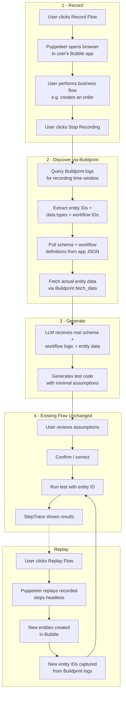

# Puppeteer Record + Buildprint Auto-Discovery Plan

## New User Flow




## How Buildprint Logs Power This

After the user finishes their browser flow, we query Buildprint advanced logs for the recording time window. The logs contain:

- `**thing_type` + `thing_id**` -- which entities were created/modified
- `**tag_message**` (`"running event"`, `"server_db.modify"`, `"action completed"`) -- what happened
- `**display**` -- human-readable workflow/action names
- `**tag_fiber_id**` -- correlates all events in a single workflow execution
- `**log_data_json**` -- detailed payload data

From this, we know exactly: which data types were touched, which entity IDs were created, and which workflows executed. We then use `get_json` to pull the actual workflow definitions (expressions, conditions, actions) and data type schemas (fields, types, relationships).

## Architecture Changes

### What Changes


| Component                   | Before                              | After                                                      |
| --------------------------- | ----------------------------------- | ---------------------------------------------------------- |
| Business logic input        | User types description in ChatPanel | Puppeteer recording + Buildprint auto-discovery            |
| Data source for LLM context | User description only               | Real schema + workflow logic + entity data from Buildprint |
| Test data creation          | Manual (user enters Entity ID)      | Automated via Puppeteer replay                             |
| Setup tab                   | Bubble API creds + LLM creds        | Buildprint MCP URL + Bubble App URL + LLM creds            |


### What Stays the Same

- Test execution in `isolated-vm` via [server/services/testRunner.js](server/services/testRunner.js)
- Bubble Data API bridging via [server/services/bubbleClient.js](server/services/bubbleClient.js) for runtime test execution
- Assumptions review + confirm flow
- StepTrace visualization
- Version history
- Chat panel (repurposed for refinement/questions after initial generation, not for initial logic description)
- Auth / Supabase / RLS

## New Dependencies

- `**puppeteer**` -- browser automation (recording + replay)
- `**@modelcontextprotocol/sdk**` -- MCP client to connect to Buildprint MCP server

## Key Files

### New Files

- `**server/services/buildprint.js**` -- MCP client wrapper. Connects to user's Buildprint MCP URL (from configs). Exposes: `getAppSummary()`, `getDataTypeSchema(types)`, `getWorkflowDefinitions(workflowIds)`, `getLogsForWindow(startMs, endMs)`, `fetchEntities(ids)`. Caches schema results per session.
- `**server/services/recorder.js**` -- Puppeteer recording + replay engine.
  - `startRecording(bubbleAppUrl)` -- launches Puppeteer with `headless: false`, injects interaction capture script, returns session ID
  - `stopRecording(sessionId)` -- closes browser, returns `{ interactions, startTimestamp, endTimestamp }`
  - `replayFlow(flowData)` -- launches headless Puppeteer, replays recorded interactions, captures new timestamps for log querying
- `**server/routes/recorder.js**` -- API routes:
  - `POST /api/recorder/start` -- start recording (takes `bubbleAppUrl`)
  - `POST /api/recorder/stop` -- stop recording, triggers Buildprint analysis, returns captured context
  - `POST /api/recorder/replay/:flowId` -- replay a saved flow, return new entity IDs
- `**client/src/components/Validator/RecorderPanel.jsx**` -- UI for record/replay. Shows: Record button, recording status indicator, captured entities summary, Replay button.

### Modified Files

- **[server/services/llm.js](server/services/llm.js)** -- Enrich LLM prompts with real Buildprint context. The `GENERATE_SYSTEM_PROMPT` and `EDIT_SYSTEM_PROMPT` get a new `{SCHEMA_CONTEXT}` block injected with actual data type fields, workflow logic, and entity data. This replaces the generic example and dramatically reduces wrong assumptions.
- **[server/routes/chat.js](server/routes/chat.js)** -- On first "edit" message for a suite with a recorded flow, auto-inject Buildprint context into the LLM call. The chat route loads the flow's discovered schema/workflow context from the DB and passes it to the LLM alongside the user's message.
- **[client/src/components/Validator.jsx](client/src/components/Validator.jsx)** -- Add RecorderPanel to the left panel. Manage recording state. Auto-fill entity ID from recording results. Add "Replay" trigger that re-runs the flow and updates entity IDs.
- **[client/src/components/Validator/ChatPanel.jsx](client/src/components/Validator/ChatPanel.jsx)** -- Change initial state from "Describe Your Test" to "Record a flow to get started" when no recording exists. After recording, show the auto-discovered context summary and allow refinement via chat.
- **[client/src/components/Setup.jsx](client/src/components/Setup.jsx)** -- Add fields: Buildprint MCP URL, Bubble App URL (the URL the user navigates to in the recording). Keep Bubble API creds for test execution. Keep LLM creds.
- **[client/src/api.js](client/src/api.js)** -- Add `startRecording()`, `stopRecording()`, `replayFlow()` API functions.

### New DB Table

`**recorded_flows`** -- stores recorded browser sessions and Buildprint-discovered context.


| Column               | Type        | Description                                         |
| -------------------- | ----------- | --------------------------------------------------- |
| id                   | UUID        | PK                                                  |
| test_suite_id        | UUID        | FK to test_suites                                   |
| bubble_app_url       | TEXT        | URL user recorded against                           |
| interactions         | JSONB       | Recorded browser steps (clicks, inputs, navigation) |
| start_timestamp_ms   | BIGINT      | When recording started (for log query)              |
| end_timestamp_ms     | BIGINT      | When recording stopped                              |
| captured_entities    | JSONB       | `[{ thingType, thingId, data }]` from Buildprint    |
| discovered_workflows | JSONB       | Workflow definitions pulled from Buildprint         |
| discovered_schema    | JSONB       | Data type schemas pulled from Buildprint            |
| primary_entity_id    | TEXT        | Main entity ID to use for testing                   |
| user_id              | UUID        | FK to auth.users                                    |
| created_at           | TIMESTAMPTZ |                                                     |


## Interaction Recording Format

The injected script captures user interactions as a JSON array:

```json
[
  { "type": "navigate", "url": "https://app.bubble.io/order/new", "ts": 1772100000000 },
  { "type": "click", "selector": "[data-testid='add-item']", "ts": 1772100005000 },
  { "type": "input", "selector": "input[name='quantity']", "value": "5", "ts": 1772100010000 },
  { "type": "click", "selector": "button.submit-order", "ts": 1772100015000 },
  { "type": "navigate", "url": "https://app.bubble.io/order/123", "ts": 1772100020000 }
]
```

Selectors are generated using a priority: `data-testid` > `id` > `aria-label` > unique CSS path. For replay, each step is executed in sequence with `waitForSelector` between steps.

## Buildprint Analysis Pipeline (server/services/buildprint.js)

After recording stops, the server runs this pipeline:

1. **Query logs**: `get_advanced_logs` with `startTime`/`endTime` from the recording window.
  Filter: `| where tag_message in ("server_db.modify", "running event", "action completed") | project thing_type, thing_id, display, tag_fiber_id, tag_message, log_data_json`
2. **Extract entities**: Deduplicate `thing_type` + `thing_id` pairs from log results.
3. **Pull schema**: For each unique `thing_type`, call `get_json` scoped to `user_types.<type_id>` to get field definitions (names, types, relationships).
4. **Pull workflows**: From `display` field in "running event" logs, identify workflow names. Use `search_json` with text search to find their definitions. Pull full workflow + action definitions via `get_json`.
5. **Fetch entity data**: Use `fetch_data` with the captured entity IDs to get actual field values.
6. **Store**: Save all discovered context to `recorded_flows` table.

## LLM Context Injection

The enriched LLM prompt for test generation becomes:

```
[Existing system prompt with trace/result format instructions]

=== APP CONTEXT (from Buildprint) ===

Data Types and Fields:
- GP_Order: Ticket Count (number), Gross Amount (number), Add Ons (list of GP_AddOn), ...
- GP_AddOn: OS AddOnType (option: Ticket/Merch/...), Quantity (number), Price (number), ...

Relevant Workflows (executed during recorded flow):
- "Calculate Order Totals": Triggered on GP_Order create. Actions: ...
- "Process Add On": Triggered on GP_AddOn create. Actions: ...

Entity Data (from recording):
- GP_Order 1771672992747x483... : { Ticket Count: 3, Gross Amount: 150.00, ... }
- GP_AddOn 1771672992748x123... : { OS AddOnType: "Ticket", Quantity: 2, Price: 50.00 }
- GP_AddOn 1771672992748x456... : { OS AddOnType: "Ticket", Quantity: 1, Price: 50.00 }

=== USER REQUEST ===
Validate that the order totals are calculated correctly based on the add-ons.
```

With this context, the LLM knows the exact field names, types, relationships, actual workflow logic, and real data -- producing far more accurate test code with near-zero assumptions.

## Setup Tab Changes

Current fields stay, new fields added:

- **Buildprint MCP URL** (required) -- e.g. `https://mcp.buildprint.ai/s/...`
- **Bubble App URL** (required) -- the URL to open in Puppeteer, e.g. `https://myapp.bubbleapps.io`
- Bubble API Base URL (required, kept for test execution)
- Bubble API Token (required, kept for test execution)
- LLM API Base URL (required)
- LLM API Key (required)
- LLM Model (required)

## Replay Flow

When the user clicks "Replay":

1. Server loads `recorded_flows.interactions` for the suite's flow
2. Launches Puppeteer in headless mode
3. Replays each interaction step (navigate, click, type) with appropriate waits
4. Records new `startTimestamp` / `endTimestamp`
5. Queries Buildprint logs for the new time window
6. Extracts new entity IDs
7. Updates `recorded_flows.captured_entities` and `primary_entity_id`
8. Returns the new entity ID to the frontend
9. Test can now be run against the fresh entity

