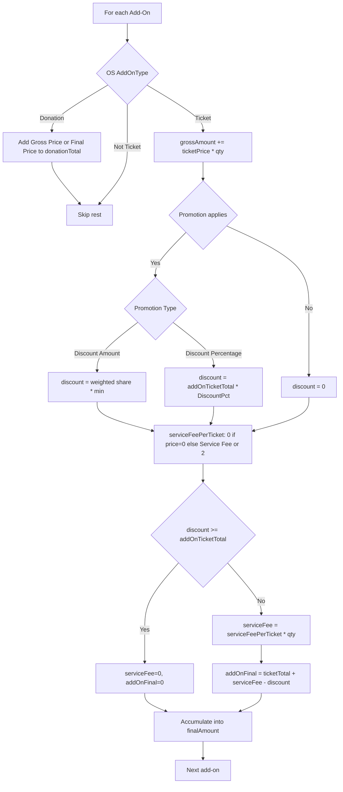
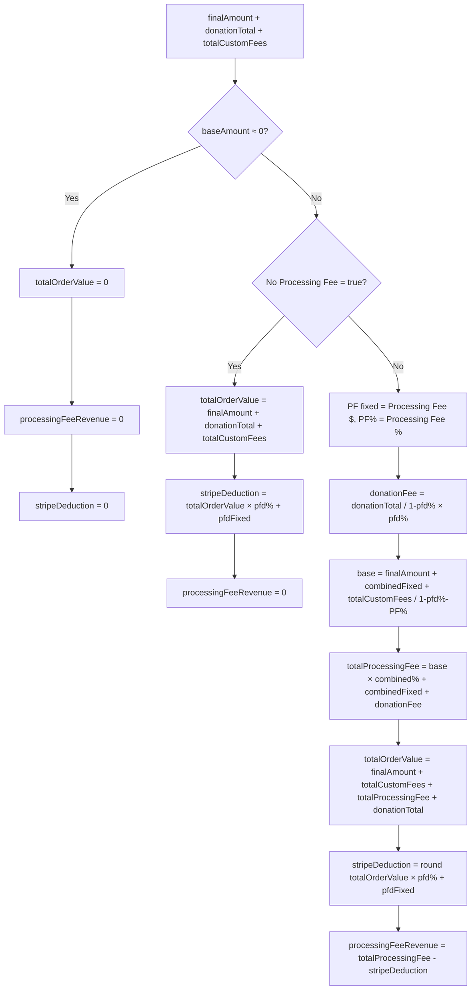
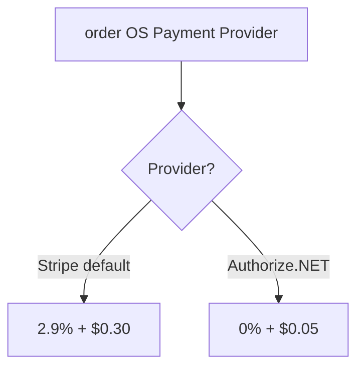
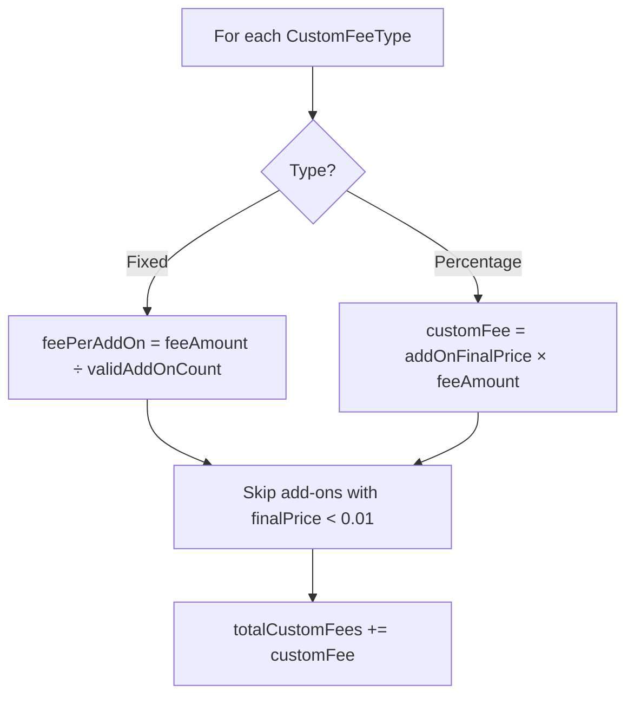
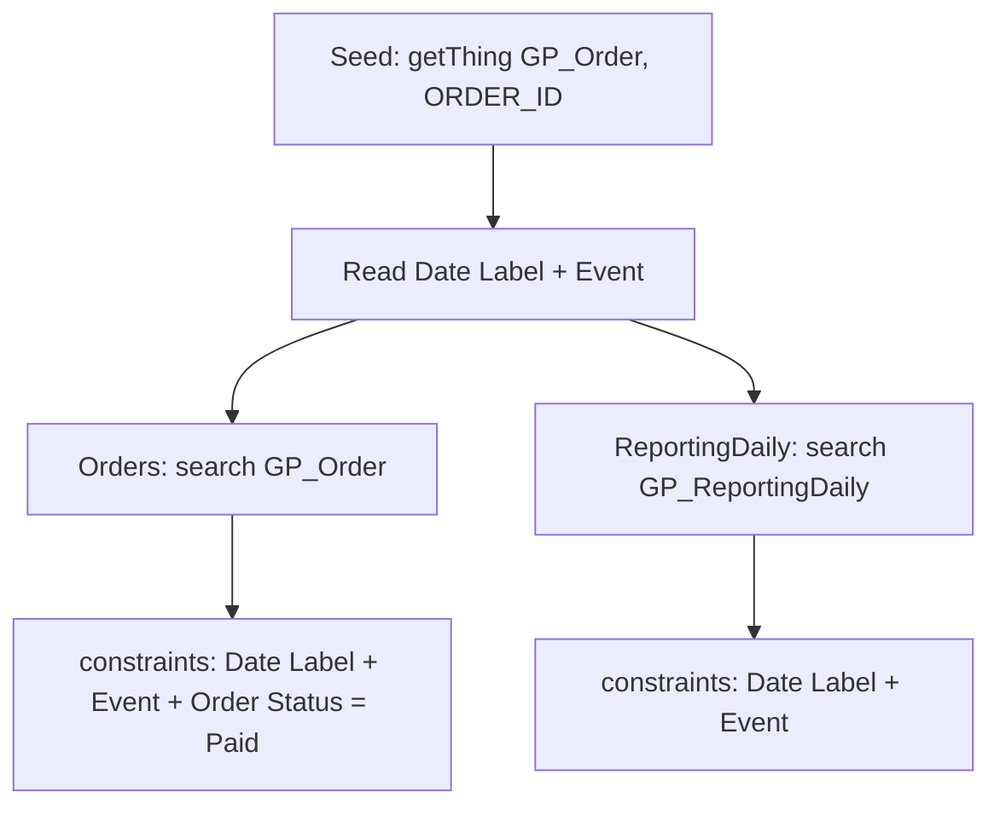
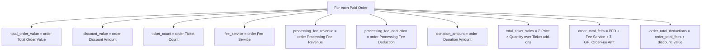
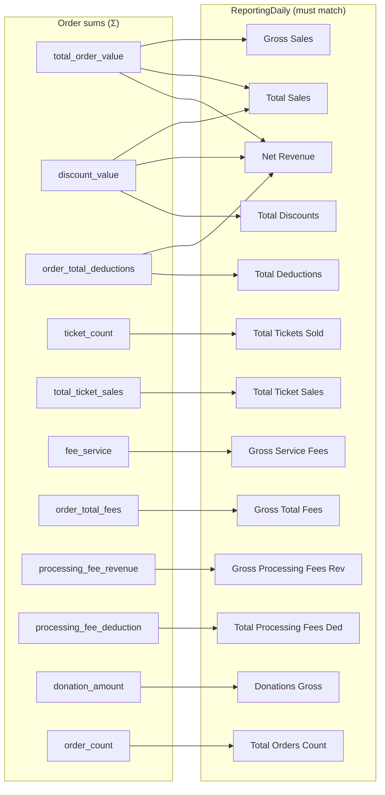
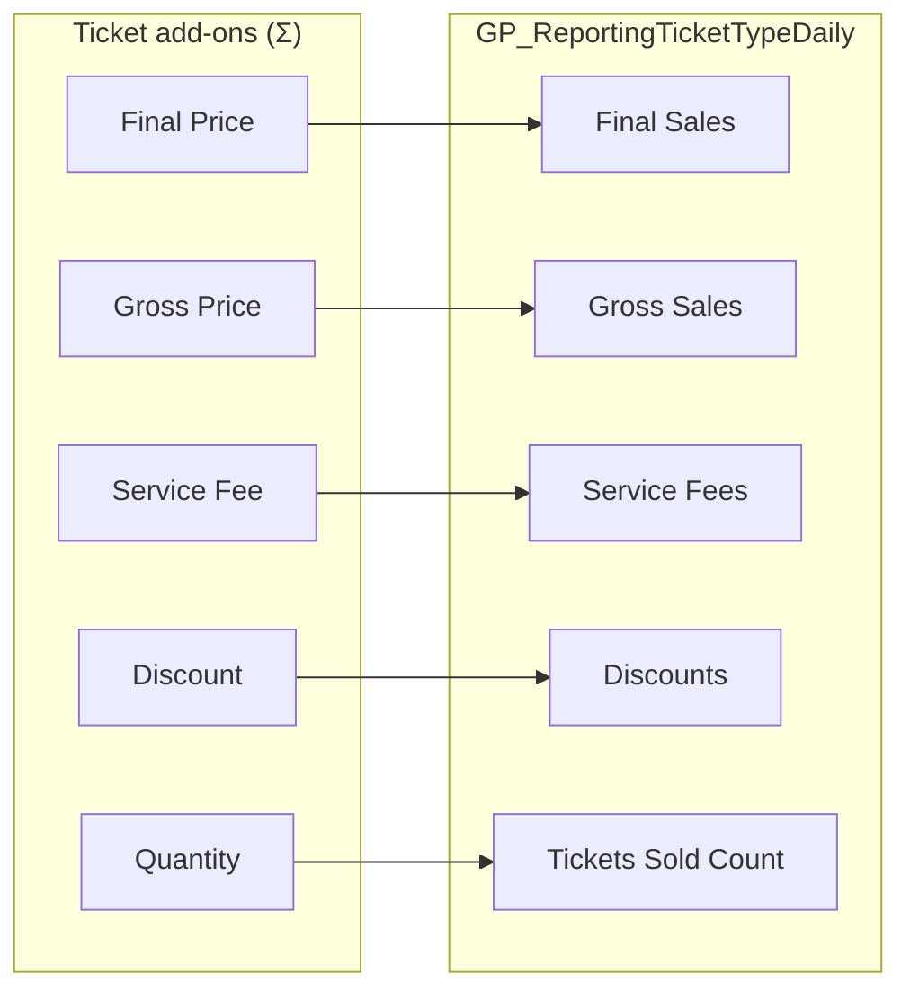

# Calculation Logic (Flowchart)

**Update this file whenever orderCalculator.js, order.test.js, or reportingDaily.test.js calculation logic changes.**

---

## Part 1: Order Validation

**Source:** `orderCalculator.js`, `order.test.js`

### Add-on processing flow



### Processing fees & total order value flow



### Payment provider (PFD)



### Custom fees flow



---

## Part 2: ReportingDaily Validation

**Source:** `reportingDaily.test.js`

### Data fetch flow



### Per-order calculation flow



### Validation mapping flow



### Step summary

| Step | Action |
|------|--------|
| 1 | Fetch seed order → Date Label, Event |
| 2 | Fetch orders (Date Label + Event + Status=Paid) |
| 3 | Fetch ReportingDaily (Date Label + Event) |
| 4 | For each order: sum order fields + compute order_total_fees, order_total_deductions |
| 5 | Sum ReportingDaily field values |
| 6 | Assert order sums = ReportingDaily sums per mapping |

### Derived equalities (ReportingDaily internal)

```
net_service_fees = total_service_fees
net_total_fees = total_fees
net_processing_fees_revenue = total_processing_fees_revenue
donations_net = donations_total
```

---

## Part 3: GP_ReportingTicketTypeDaily Validation

**Source:** `reportingDaily.test.js`  
**Workflow:** gp_r_ticket_daily_updater — one record per Ticket add-on.

### Per-addon mapping (workflow → our calc)

| GP_ReportingTicketTypeDaily field | Source (GP_AddOn) | Our calc |
|----------------------------------|-------------------|----------|
| Final Sales (gross_sales_number) | addon Final Price | addon Final Price |
| Gross Sales (gross_sales1_number) | addon Gross Price | addon total_price_before_fees |
| Service Fees (service_fees_number) | addon Service Fee | addon Service Fee |
| Discounts (discounts_number) | addon Discount | addon Discount |
| Tickets Sold Count (tickets_sold_count_number) | addon Quantity | addon Quantity |

### Validation flow



---

## Part 4: GP_ReportingCustomFeeDaily Validation

**Source:** `reportingDaily.test.js`  
**Workflow:** gp_r_customfee_daily_updater — one record per (order + Fee Type).

### Per-fee-type mapping (workflow)

- Filters order add-ons' GP_OrderFee list where GP_CustomFee = fee type
- amount_number (Gross Total) = sum of GP_OrderFee.fee_amount for that fee type
- net_total_number (Net Total) = same sum
- fee_type = GP_CustomFeeType

### Our calculation

- For each paid order: sum all GP_OrderFee amounts (GP_OrderFee Amt)
- Total across orders = customFeeSums.amount = customFeeSums.net_total

### Validation

| GP_ReportingCustomFeeDaily | Our calc |
|----------------------------|----------|
| Gross Total (amount_number) | sum(GP_OrderFee Amt) across orders |
| Net Total (net_total_number) | same |
